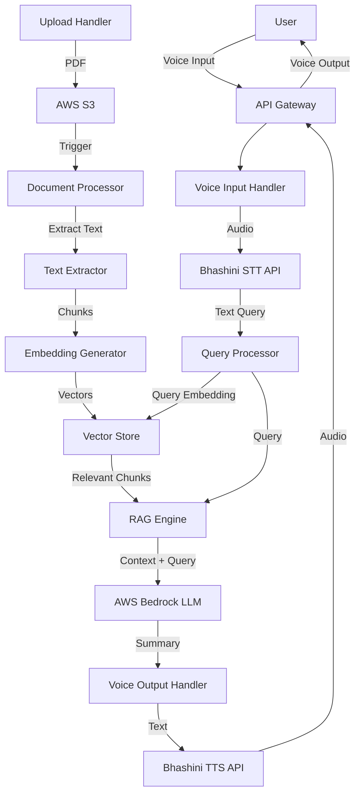

# Design Document: Gram-Vani

## Overview

Gram-Vani is a voice-first RAG application that bridges the gap between complex government documents and citizens who need to understand them. The system orchestrates multiple AWS and external services to provide a seamless voice-to-voice interaction experience.

The core architecture follows a pipeline pattern:
1. Voice input → Speech-to-Text (Bhashini)
2. Text query → Document Retrieval (AWS Bedrock + Vector Store)
3. Retrieved context + Query → Summary Generation (AWS Bedrock)
4. Summary text → Speech synthesis (Bhashini)
5. Voice output → User

The design emphasizes resilience, multi-language support, and simplicity for end users who may not be technically sophisticated.

## Architecture

### High-Level Architecture



### Component Architecture

The system is organized into distinct layers:

1. **API Layer**: Handles HTTP requests, authentication, and response formatting
2. **Service Layer**: Business logic for voice processing, document management, and RAG operations
3. **Integration Layer**: Adapters for AWS services and Bhashini APIs
4. **Storage Layer**: S3 for documents, vector database for embeddings

### Technology Stack

- **Runtime**: Python 3.11+ (for AWS Lambda compatibility and rich ML ecosystem)
- **API Framework**: FastAPI or AWS Lambda with API Gateway
- **Vector Database**: AWS OpenSearch Serverless or Pinecone
- **AWS Services**: S3, Bedrock, Lambda, API Gateway
- **External APIs**: Bhashini ULCA APIs (STT/TTS for Indian languages)
- **PDF Processing**: PyPDF2 or pdfplumber
- **Embeddings**: AWS Bedrock Titan Embeddings

## Components and Interfaces

### 1. API Gateway Layer

**Purpose**: Entry point for all user interactions

**Interfaces**:
```python
POST /upload
  Request: multipart/form-data with PDF file
  Response: {upload_id: str, status: str, message: str}

POST /query
  Request: {audio: base64_encoded_audio, language: str}
  Response: {audio: base64_encoded_audio, text: str, query_id: str}

GET /status/{query_id}
  Response: {status: str, progress: str}
```

### 2. Document Upload Handler

**Purpose**: Manages PDF uploads and triggers processing

**Interface**:
```python
class DocumentUploadHandler:
    def upload_document(file: UploadFile, user_id: str) -> UploadResult
    def validate_pdf(file: UploadFile) -> ValidationResult
```

**Responsibilities**:
- Validate PDF format and size
- Upload to S3 with metadata
- Trigger document processing pipeline
- Return upload confirmation

### 3. Document Processor

**Purpose**: Extracts and indexes PDF content

**Interface**:
```python
class DocumentProcessor:
    def process_document(s3_key: str) -> ProcessingResult
    def extract_text(pdf_bytes: bytes) -> List[str]
    def chunk_text(text: str, chunk_size: int, overlap: int) -> List[TextChunk]
    def generate_embeddings(chunks: List[TextChunk]) -> List[Embedding]
    def store_embeddings(embeddings: List[Embedding], metadata: dict) -> None
```

**Processing Pipeline**:
1. Download PDF from S3
2. Extract text using PDF library
3. Split text into overlapping chunks (500-1000 tokens)
4. Generate embeddings using Bedrock Titan
5. Store embeddings in vector database with metadata

### 4. Voice Input Handler

**Purpose**: Converts voice to text query

**Interface**:
```python
class VoiceInputHandler:
    def transcribe_audio(audio: bytes, language: str) -> TranscriptionResult
    def validate_transcription(text: str) -> bool
```

**Integration**:
- Calls Bhashini STT API
- Handles language detection and validation
- Implements retry logic for API failures

### 5. Query Processor

**Purpose**: Orchestrates the query-to-answer pipeline

**Interface**:
```python
class QueryProcessor:
    def process_query(query: str, user_id: str, language: str) -> QueryResult
    def generate_query_embedding(query: str) -> Embedding
    def retrieve_context(embedding: Embedding, top_k: int) -> List[DocumentChunk]
```

**Workflow**:
1. Generate embedding for query
2. Search vector database for similar chunks
3. Retrieve top-k most relevant chunks
4. Pass to RAG engine for answer generation

### 6. RAG Engine

**Purpose**: Generates answers using retrieved context

**Interface**:
```python
class RAGEngine:
    def generate_answer(query: str, context: List[DocumentChunk], language: str) -> str
    def build_prompt(query: str, context: List[DocumentChunk]) -> str
    def call_bedrock(prompt: str, language: str) -> str
```

**Prompt Structure**:
```
You are a helpful assistant that explains government documents in simple language.

Context from documents:
{context_chunks}

User question: {query}

Provide a clear, simple answer in {language} based only on the context above. 
If the context doesn't contain enough information, say so clearly.
```

### 7. Voice Output Handler

**Purpose**: Converts text summaries to speech

**Interface**:
```python
class VoiceOutputHandler:
    def synthesize_speech(text: str, language: str) -> bytes
    def validate_audio(audio: bytes) -> bool
```

**Integration**:
- Calls Bhashini TTS API
- Handles language-specific voice selection
- Implements retry logic with exponential backoff

### 8. AWS Integration Layer

**Purpose**: Abstracts AWS service interactions

**Interface**:
```python
class S3Client:
    def upload_file(file: bytes, key: str, metadata: dict) -> str
    def download_file(key: str) -> bytes
    def delete_file(key: str) -> bool

class BedrockClient:
    def generate_embeddings(texts: List[str]) -> List[Embedding]
    def generate_text(prompt: str, model_id: str, params: dict) -> str

class VectorStoreClient:
    def index_embeddings(embeddings: List[Embedding], metadata: List[dict]) -> None
    def search(query_embedding: Embedding, top_k: int, filters: dict) -> List[SearchResult]
```

### 9. Bhashini ULCA Integration Layer (Voice Service)

**Purpose**: Abstracts Bhashini ULCA API interactions for speech processing

**Interface**:
```python
class BhashiniClient:
    def __init__(self, ulca_api_key: str, ulca_user_id: str):
        """Initialize with Bhashini ULCA credentials"""
        pass
    
    def speech_to_text(audio: bytes, source_language: str) -> STTResult
        """Convert speech to text using Bhashini ULCA STT API"""
        pass
    
    def text_to_speech(text: str, target_language: str) -> bytes
        """Convert text to speech using Bhashini ULCA TTS API"""
        pass
    
    def get_supported_languages() -> List[str]
        """Get list of supported Indian languages from ULCA"""
        pass
```

**ULCA API Integration Details**:
- Uses Bhashini ULCA (Universal Language Contribution API) endpoints
- Requires API key and user ID for authentication
- Supports multiple Indian languages (Hindi, Tamil, Telugu, Bengali, etc.)
- Handles ULCA-specific request/response formats

## Data Models

### Document Metadata
```python
@dataclass
class DocumentMetadata:
    document_id: str
    user_id: str
    filename: str
    s3_key: str
    upload_timestamp: datetime
    processing_status: str  # pending, processing, completed, failed
    num_pages: int
    num_chunks: int
```

### Text Chunk
```python
@dataclass
class TextChunk:
    chunk_id: str
    document_id: str
    text: str
    page_number: int
    chunk_index: int
    embedding: Optional[List[float]]
```

### Query Result
```python
@dataclass
class QueryResult:
    query_id: str
    query_text: str
    answer_text: str
    answer_audio: bytes
    language: str
    retrieved_chunks: List[TextChunk]
    processing_time_ms: int
```

### API Response Models
```python
@dataclass
class UploadResult:
    upload_id: str
    status: str  # success, failed
    message: str
    document_id: Optional[str]

@dataclass
class TranscriptionResult:
    text: str
    language: str
    confidence: float
    
@dataclass
class ProcessingResult:
    document_id: str
    status: str
    num_chunks: int
    error: Optional[str]
```


## Correctness Properties

A property is a characteristic or behavior that should hold true across all valid executions of a system—essentially, a formal statement about what the system should do. Properties serve as the bridge between human-readable specifications and machine-verifiable correctness guarantees.

### Document Upload and Storage Properties

**Property 1: Successful upload confirmation and storage**
*For any* valid PDF file, when uploaded by an authenticated user, the system should store it in S3 and return a success confirmation with a document ID.
**Validates: Requirements 1.1, 1.4**

**Property 2: Invalid file rejection**
*For any* non-PDF file or corrupted file, the upload should be rejected with a descriptive error message, and no file should be stored in S3.
**Validates: Requirements 1.2, 1.3**

**Property 3: Upload triggers indexing**
*For any* successfully uploaded PDF, the document processing pipeline should be triggered and the document should eventually appear in the searchable index.
**Validates: Requirements 1.5**

### Document Processing Properties

**Property 4: Text extraction completeness**
*For any* PDF with text content, the extraction process should produce non-empty text output that includes content from all pages.
**Validates: Requirements 2.1, 2.5**

**Property 5: Chunking produces indexed content**
*For any* extracted text, the chunking process should produce at least one searchable chunk in the Document_Index with associated embeddings.
**Validates: Requirements 2.2**

**Property 6: Metadata preservation**
*For any* indexed document, the Document_Index should contain metadata including document name, upload timestamp, and user ID.
**Validates: Requirements 2.4**

### Voice Input Processing Properties

**Property 7: Voice input pipeline**
*For any* voice input audio, the system should call the Bhashini STT API and, if transcription succeeds, process the resulting text as a query.
**Validates: Requirements 3.1, 3.4**

**Property 8: Transcription validation**
*For any* transcription result from Voice_Processor, the system should validate that the text is non-empty before proceeding with query processing.
**Validates: Requirements 3.2**

**Property 9: Multi-language voice input support**
*For any* supported Indian language, voice input in that language should be successfully transcribed to text.
**Validates: Requirements 3.5, 8.1**

### Information Retrieval Properties

**Property 10: Query retrieval**
*For any* text query, the RAG_Engine should search the Document_Index and return ranked document chunks when relevant content exists.
**Validates: Requirements 4.1, 4.2**

**Property 11: Relevance ranking**
*For any* set of retrieved document chunks, they should be ordered by relevance score in descending order.
**Validates: Requirements 4.4**

**Property 12: Multi-document retrieval**
*For any* query that matches content in multiple documents, the retrieved chunks should include content from all relevant documents.
**Validates: Requirements 4.5**

### Summary Generation Properties

**Property 13: Summary generation from context**
*For any* retrieved document chunks and query, the RAG_Engine should generate a summary using AWS Bedrock.
**Validates: Requirements 5.1**

**Property 14: Grounded responses**
*For any* generated summary, all factual claims should be traceable to the retrieved document chunks (no hallucination).
**Validates: Requirements 5.3**

### Voice Output Properties

**Property 15: Text-to-speech conversion**
*For any* generated summary text, the system should call Bhashini TTS API and return audio output to the user.
**Validates: Requirements 6.1, 6.2**

**Property 16: Language consistency**
*For any* voice query and response pair, the output language should match the input language detected from the voice input.
**Validates: Requirements 6.4, 8.3**

**Property 17: Multi-language voice output support**
*For any* supported Indian language, text summaries in that language should be successfully converted to speech.
**Validates: Requirements 8.2**

### Error Handling Properties

**Property 18: Error logging**
*For any* error condition (API failure, processing error, validation failure), the system should create a log entry with error details, timestamp, and context.
**Validates: Requirements 7.5**

**Property 19: Retry with exponential backoff**
*For any* failed external API call, the system should retry with exponentially increasing delays between attempts.
**Validates: Requirements 10.3**

### Security Properties

**Property 20: Authentication enforcement**
*For any* document upload or access request, the system should verify user authentication and reject unauthenticated requests.
**Validates: Requirements 9.1, 9.5**

**Property 21: Data encryption**
*For any* PDF stored in S3, encryption at rest should be enabled, and for any API call to external services, secure HTTPS connections should be used.
**Validates: Requirements 9.2, 9.3, 9.4**

**Property 22: API response validation**
*For any* response from external APIs (AWS Bedrock, Bhashini, S3), the system should validate the response structure and content before processing.
**Validates: Requirements 10.5**

## Error Handling

### Error Categories

1. **Validation Errors**
   - Invalid file format
   - Empty transcription
   - Malformed API responses
   - Response: 400 Bad Request with descriptive message

2. **Authentication/Authorization Errors**
   - Missing authentication
   - Insufficient permissions
   - Response: 401 Unauthorized or 403 Forbidden

3. **External Service Errors**
   - AWS service unavailable
   - Bhashini API timeout
   - Vector database connection failure
   - Response: 503 Service Unavailable with retry-after header

4. **Processing Errors**
   - PDF extraction failure
   - Embedding generation failure
   - No relevant documents found
   - Response: 500 Internal Server Error or 404 Not Found

### Error Handling Strategies

**Retry Logic**:
- Implement exponential backoff for transient failures
- Maximum 3 retry attempts for API calls
- Initial delay: 1 second, multiplier: 2
- Circuit breaker pattern for repeated failures

**Graceful Degradation**:
- If TTS fails, return text response as fallback
- If embedding generation fails, use keyword search as fallback
- If language detection fails, default to Hindi

**User Communication**:
- All errors return user-friendly messages
- Technical details logged but not exposed to users
- Provide actionable guidance (e.g., "Please try again" or "Upload a different file")

**Monitoring and Alerting**:
- Log all errors with correlation IDs
- Alert on error rate thresholds
- Track API latency and availability

### Error Response Format

```python
@dataclass
class ErrorResponse:
    error_code: str
    message: str
    details: Optional[str]
    retry_after: Optional[int]  # seconds
    correlation_id: str
```

## Testing Strategy

### Dual Testing Approach

The testing strategy employs both unit tests and property-based tests to ensure comprehensive coverage:

- **Unit tests**: Verify specific examples, edge cases, and error conditions
- **Property-based tests**: Verify universal properties across all inputs

Together, these approaches provide comprehensive coverage where unit tests catch concrete bugs and property-based tests verify general correctness.

### Property-Based Testing

**Framework**: Hypothesis (Python)

**Configuration**:
- Minimum 100 iterations per property test
- Each test tagged with feature name and property number
- Tag format: `# Feature: gram-vani, Property N: [property text]`

**Test Organization**:
- Each correctness property implemented as a single property-based test
- Tests organized by component (upload, processing, retrieval, etc.)
- Shared generators for common data types (PDFs, audio, queries)

**Example Property Test Structure**:
```python
from hypothesis import given, strategies as st

@given(pdf_file=st.binary(min_size=100, max_size=10000))
def test_upload_confirmation_and_storage(pdf_file):
    """
    Feature: gram-vani, Property 1: Successful upload confirmation and storage
    For any valid PDF file, when uploaded by an authenticated user,
    the system should store it in S3 and return a success confirmation.
    """
    # Test implementation
    pass
```

### Unit Testing

**Framework**: pytest

**Focus Areas**:
- Specific examples of successful operations
- Edge cases (empty files, very large files, special characters)
- Error conditions (network failures, invalid inputs)
- Integration points between components

**Test Coverage Goals**:
- 80%+ code coverage
- All error paths tested
- All API integrations mocked and tested

### Integration Testing

**Scope**:
- End-to-end workflow from voice input to voice output
- AWS service integrations (S3, Bedrock)
- Bhashini API integration
- Database operations

**Environment**:
- Use LocalStack for AWS services in CI/CD
- Mock Bhashini APIs with recorded responses
- Test database with sample documents

### Performance Testing

**Metrics**:
- Voice-to-voice latency (target: < 5 seconds)
- Document processing time (target: < 30 seconds per document)
- Concurrent user capacity (target: 100 simultaneous queries)
- Vector search latency (target: < 500ms)

**Tools**:
- Locust for load testing
- AWS CloudWatch for monitoring
- Custom metrics for RAG-specific performance

### Test Data

**Generators**:
- PDF files with varying content and sizes
- Audio files in multiple Indian languages
- Text queries of varying complexity
- Document chunks with embeddings

**Fixtures**:
- Sample government documents
- Pre-recorded voice samples
- Known query-answer pairs for validation
